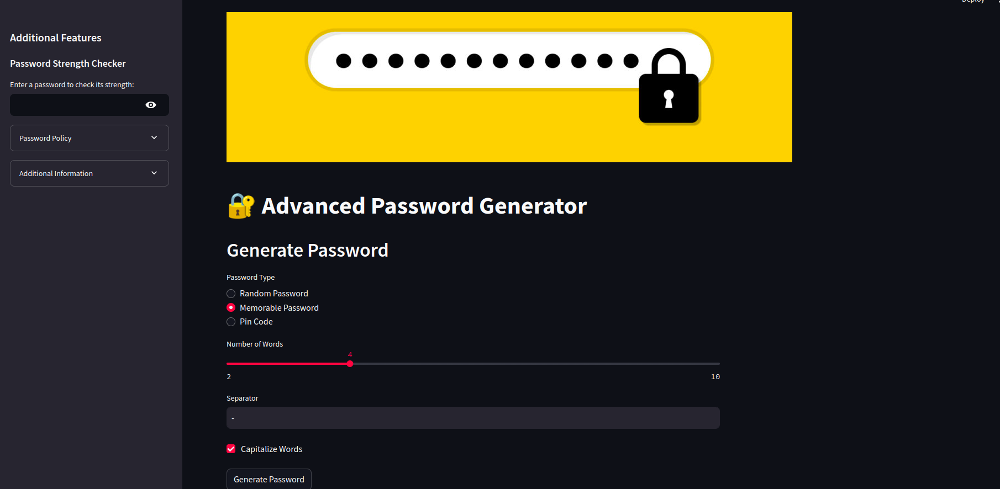
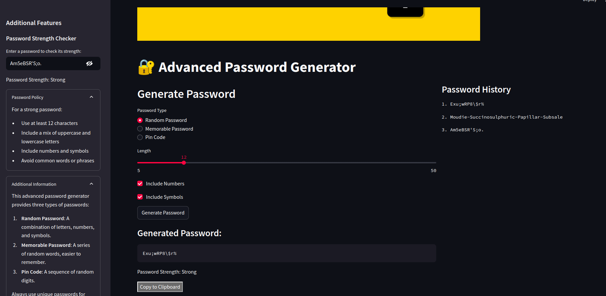

# Advanced Password Generator 🔐


An interactive web application for generating secure passwords with various options and features.

 <br>
<table>
  <tr>
    <td></td>
    <td></td>
  </tr>
</table>


## Features

- Generate three types of passwords:
  - Random passwords (letters, numbers, symbols)
  - Memorable passwords (word-based)
  - PIN codes (numeric)
- Customize password length and composition
- Check password strength
- View password generation history
- Copy generated passwords to clipboard
- Responsive and user-friendly interface

## Installation

1. Clone the repository:
    ```bash
    git clone https://github.com/MahtabRanjbar/password_generator_dashboard.git
2. Go to project directory:
    ```bash
    cd password_generator_dashboard
    ```
3. Install the required packages:
    ```bash 
    pip install -r requirements.txt
    ```
## Usage

1. Run the Streamlit app:

    ```bash 
    streamlit run src/app.py
    ```
2. Open your web browser and navigate to the URL displayed in the terminal (usually `http://localhost:8501`).


## Contributing

Contributions are welcome! Please feel free to submit a Pull Request.

## License

This project is licensed under the MIT License - see the [LICENSE](LICENSE) file for details.
